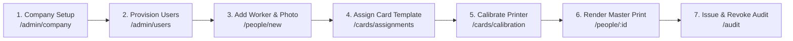

# HR Platform On-Premises MVP: Pilot Runbook & Operational Guide
**Version:** `v1.0.0-pilot.1` | **Target Deployment:** Clean On-Premises Host (Windows 11 / Ubuntu 22.04 LTS)

---

## 1. Quick-Start Checklist for System Administrators

### 1.1 Fresh Installation (Loopback Mode)
1. Extract the release archive to your deployment directory (e.g., `C:\hr-platform` or `/opt/hr-platform`).
2. Run the platform bootstrap script:
   - **Linux / macOS**: `./pilot.sh install`
   - **Windows (PowerShell as Administrator)**: `.\pilot.ps1 install`
3. The installer generates cryptographic keys in `.env`, starts PostgreSQL, applies schema migrations, and launches all services bound to loopback `127.0.0.1`.

### 1.2 Initial Activation Ceremony
1. Open your browser on the host machine to `http://localhost/activate`.
2. Follow the 3-step activation wizard:
   - Provide the initial bootstrap key `admin/admin`.
   - Set a strong Master Password (Argon2id parameters are automatically derived).
   - Record the 8 emergency one-time recovery codes in a secure physical location.
   - Confirm local backup responsibility.
3. The temporary `admin/admin` bootstrap hash is permanently destroyed upon completion.

### 1.3 Factory LAN Enablement (Smartphone Capture & Multi-Workstation)
1. After activation is complete, enable LAN access:
   - **Linux**: `./pilot.sh lan-enable`
   - **Windows**: `.\pilot.ps1 lan-enable`
2. Caddy now serves automated internal TLS across your factory Wi-Fi at `https://<host-ip>`.
3. To enable trusted smartphone camera capture without browser certificate warnings:
   - Navigate to `https://<host-ip>/admin/system` -> **LAN & Internal TLS**.
   - Download the Root CA Certificate.
   - Install the certificate on operator smartphones (iOS: Settings -> Profile Downloaded -> Certificate Trust Settings; Android: Settings -> Security -> Install from Storage -> CA Certificate).

---

## 2. Day-to-Day Operations & Maintenance

| Operational Task | Linux Command | Windows Command |
|---|---|---|
| **Check System Status** | `./pilot.sh status` | `.\pilot.ps1 status` |
| **Start Stack** | `./pilot.sh start` | `.\pilot.ps1 start` |
| **Graceful Shutdown** | `./pilot.sh stop` | `.\pilot.ps1 stop` |
| **Immediate Backup** | `./pilot.sh backup` | `.\pilot.ps1 backup` |
| **Safe Upgrade** | `./pilot.sh upgrade` | `.\pilot.ps1 upgrade` |
| **Generate Support Bundle** | `./pilot.sh support-bundle` | `.\pilot.ps1 support-bundle` |
| **Restrict to Localhost** | `./pilot.sh lan-disable` | `.\pilot.ps1 lan-disable` |

---

## 3. Data Storage & Physical Backup Layout

All persistent state is stored in Docker named volumes with strict permissions:
- **`hr_postgres_prod_data`**: PostgreSQL relational database (tenant data, workers, roles, logs).
- **`hr_media_prod_data`**: Encrypted photos, derivatives (300 DPI master, thumbnail), and organization logos.
- **`hr_backup_prod_data`**: AES-256-GCM encrypted `.hrbackup` bundles.
- **`hr_caddy_prod_data`**: Local TLS Root CA private key and issued certificates.

### 3.1 Copying Backups Offsite
Backups stored in `hr_backup_prod_data` are standalone, authenticated AES-256-GCM packages. You can safely copy `.hrbackup` files to offsite USB drives or network shares. They contain zero plaintext secrets and cannot be decrypted without the system encryption passphrase.

---

## 4. End-to-End Operator Workflow

1. **Company & Hierarchy Setup**: Upload company logo, set Bengali/English organizational units, and establish job categories (`/organization`, `/admin/company`).
2. **Worker Registration**: Input worker biographical names (English & native Bengali script), select employment classification, capture portrait photo directly or via QR phone handoff (`/people/new`).
3. **Card Assignment & Calibration**: Assign bilingual physical format (60 × 90 mm vertical), print calibration sheet, measure 50 mm line with calipers, and enter fine alignment offsets (`/cards/calibration`).
4. **Print Execution & Audit**: Export exact-size master PDF or high-resolution 300 DPI PNG, verify MediaBox dimensions, issue physical card, and record immutable replacement reasons when reprinting (`/people/[id]`).
