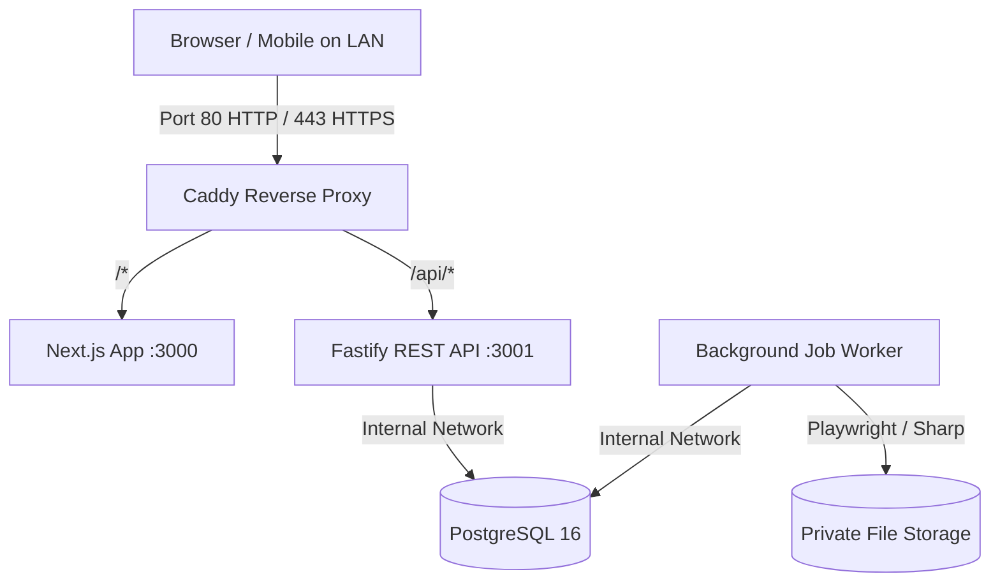

# System Architecture Document

**Project:** Local-First HR Employee ID-Card Platform  
**Status:** Baseline Established (Phase 0)  
**Revision:** 1.0 (2026-08-24)

---

## 1. System Overview & Monorepo Shape

The system is architected as a TypeScript monorepo managed with **pnpm workspaces** and **Turborepo**.

```text
hr-platform/
├── apps/
│   ├── web/           # Next.js 15 App Router (Landing, Authenticated App, SSR/Static)
│   ├── api/           # Fastify 5 REST API Server (Business logic, default-deny auth)
│   └── worker/        # Node.js Background Job Worker (PostgreSQL queue, Sharp, Playwright)
├── packages/
│   ├── config/        # Typed Zod environment variable parsing and validation
│   ├── domain/        # Domain entities, permissions, roles, and card dimension models
│   ├── schemas/       # Shared Zod / TypeBox request/response schemas
│   ├── db/            # Prisma ORM, PostgreSQL schema, migrations, seed runners
│   ├── ui/            # Owned Tailwind design tokens, Radix UI primitives, layout utilities
│   ├── card-kit/      # Physical mm-to-pixel card calculations & geometry engine
│   ├── i18n/          # Self-hosted Noto Sans & Bengali fonts, message dictionaries
│   └── fixtures/      # Fictional seed data and test fixtures
└── docker/            # Multi-stage Dockerfiles and Caddy reverse proxy configs
```

---

## 2. Component Boundaries & Network Topology

### In Development (`pnpm dev`)

- `apps/web`: Port `3000` (Next.js HMR)
- `apps/api`: Port `3001` (Fastify auto-reload)
- `apps/worker`: Node process with database heartbeat
- PostgreSQL: Docker container listening on `localhost:5432`

### In Production-Like Local Stack (`docker-compose.yml`)



- **PostgreSQL** is strictly isolated inside the internal Docker network (`hr-platform_default`) and is **never** exposed to the host machine or public ports.

---

## 3. Technology Stack Invariants

| Layer               | Approved Technology                           | Purpose                                                      |
| ------------------- | --------------------------------------------- | ------------------------------------------------------------ |
| Monorepo & Pipeline | TypeScript, pnpm, Turborepo                   | Type-safe code sharing across packages and apps              |
| Web Application     | Next.js 15 App Router, React 19, Tailwind CSS | Fast SSR landing page, responsive local application shell    |
| API Server          | Fastify 5, `@fastify/cors`, `@fastify/helmet` | Low overhead REST API with compiled schema validation        |
| Database & ORM      | PostgreSQL 16, Prisma ORM                     | Relational transactions, migrations, and tenant isolation    |
| Background Worker   | PostgreSQL-backed Queue, Sharp, Playwright    | Exact-size PDF/PNG rendering, CSV/ZIP processing             |
| Reverse Proxy & TLS | Caddy 2                                       | Automatic internal TLS for trusted LAN mobile camera capture |
| Typography & I18n   | Self-hosted Noto Sans & Noto Sans Bengali     | Deterministic rendering without remote CDN dependencies      |
