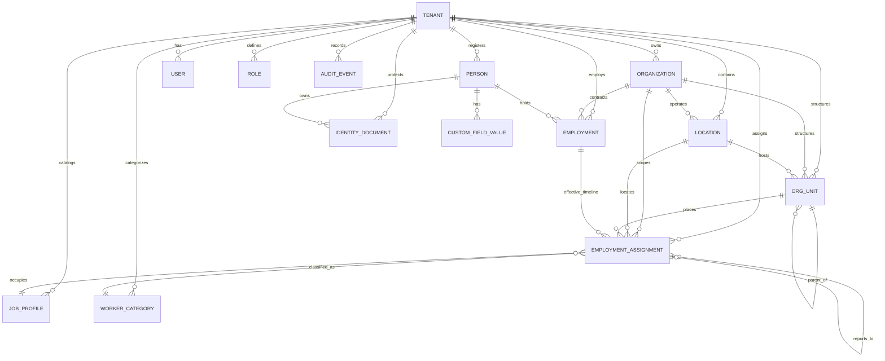

# Data Model Documentation

**Project:** Local-First HR Employee ID-Card Platform  
**Status:** Phase 4 Updated (Worker Registry, Employment Records & Cryptographic Identity Protection)  
**Revision:** 3.0 (2026-08-24)

---

## 1. Multi-Tenancy Design

Every domain record in the PostgreSQL database carries `tenant_id` from day one. In local on-premises installations, a single default workspace tenant (`slug = "default"`) is used, preserving 100% compatibility with future hosted multi-tenant operations.

---

## 2. Core Entity Relationship Diagram

---

## 3. Table Definitions

### `tenants`

- `id` (UUID, PK): Unique tenant identifier.
- `slug` (String, Unique): Alphanumeric URL slug.
- `name` (String): Display name of workspace.
- `created_at`, `updated_at`: Timestamps.

### `organizations`

- `id` (UUID, PK): Unique organization identifier.
- `tenant_id` (UUID, FK -> `tenants.id`): Tenant scope.
- `name` (String): Legal entity name.
- `display_name` (String, Optional): Trade / operational display name.
- `code` (String): Unique organization code within the tenant.
- `logo_path` (String, Optional): Sanitized media storage path.
- `primary_color` (String): Hex brand color (e.g. `#134E4A`).
- `secondary_color` (String): Secondary brand color.
- `accent_color` (String): Accent highlight color.
- `locale` (String): Default regional locale (e.g. `en-US`, `bn-BD`).
- `timezone` (String): Workspace timezone (e.g. `Asia/Dhaka`).
- `address` (JSON, Optional): Physical / postal address object.
- `contact_email` (String, Optional): Official contact email.
- `contact_phone` (String, Optional): Official contact telephone.
- `employee_number_rule` (JSON, Optional): Number formatting rule (`{ prefix, padLength, nextSequence }`).
- `is_default` (Boolean): Default tenant organization flag.

### `locations`

- `id` (UUID, PK): Unique location identifier.
- `tenant_id` (UUID, FK -> `tenants.id`): Tenant scope.
- `organization_id` (UUID, FK -> `organizations.id`): Parent organization.
- `name` (String): Location name (e.g. "Gazipur Manufacturing Plant").
- `code` (String): Location code unique within organization.
- `type` (Enum): `HEADQUARTERS` | `OFFICE` | `FACTORY` | `BRANCH` | `SITE` | `WAREHOUSE` | `OTHER`.
- `address` (JSON, Optional): Physical address object.
- `contact_phone` (String, Optional): Phone contact.
- `is_default` (Boolean): Primary organization site flag.

### `org_units`

- `id` (UUID, PK): Unique organizational unit identifier.
- `tenant_id` (UUID, FK -> `tenants.id`): Tenant scope.
- `organization_id` (UUID, FK -> `organizations.id`): Parent organization.
- `parent_id` (UUID, Optional, FK -> `org_units.id`): Self-referencing parent unit.
- `name` (String): Unit name (Latin script).
- `name_bangla` (String, Optional): Native Bengali script name (`বাংলা`).
- `code` (String): Unique unit code within organization.
- `type` (Enum): `DIVISION` | `DEPARTMENT` | `SECTION` | `TEAM` | `LINE` | `OTHER`.
- `location_id` (UUID, Optional, FK -> `locations.id`): Associated facility / site.
- `is_archived` (Boolean): Soft archive flag preserving historical card issue snapshot integrity.
- `sort_order` (Int): Display sort priority.

### `people`

- `id` (UUID, PK): Unique person human identifier.
- `tenant_id` (UUID, FK -> `tenants.id`): Tenant scope.
- `display_name` (String): Required primary display name.
- `display_name_latin` (String, Optional): Latin transliterated display name.
- `display_name_native` (String, Optional): Native script name (Bengali `বাংলা`).
- `given_name` (String, Optional): First / Given name.
- `family_name` (String, Optional): Surname / Family name.
- `other_names` (String, Optional): Middle / generational names.
- `phonetic_name` (String, Optional): Phonetic pronunciation guide.
- `gender` (Enum, Optional): `MALE` | `FEMALE` | `OTHER` | `UNSPECIFIED`.
- `date_of_birth` (String, Optional): Normalized `YYYY-MM-DD` (supports leap days).
- `blood_group` (String, Optional): Blood group (`A+`, `O+`, etc.).
- `photo_path` (String, Optional): Sanitized private storage photo path.
- `primary_phone` (String, Optional): Normalized E.164 phone.
- `primary_email` (String, Optional): Lowercase email.
- `emergency_contact_name` (String, Optional): Emergency contact full name.
- `emergency_contact_phone` (String, Optional): Emergency contact telephone.
- `version` (Int): Optimistic concurrency integer incremented on every update.

### `employments`

- `id` (UUID, PK): Unique employment assignment identifier.
- `tenant_id` (UUID, FK -> `tenants.id`): Tenant scope.
- `person_id` (UUID, FK -> `people.id`): Associated person.
- `organization_id` (UUID, FK -> `organizations.id`): Employing organization.
- `location_id` (UUID, Optional, FK -> `locations.id`): Assigned location.
- `org_unit_id` (UUID, Optional, FK -> `org_units.id`): Assigned organizational unit.
- `employee_number` (String): Unique employee identifier within organization scope (`organization_id + employee_number`).
- `job_title` (String): Official role title (e.g. "Senior Production Manager").
- `job_category` (Enum): `MANAGEMENT` | `STAFF` | `OPERATOR` | `WORKER` | `CONTRACTOR` | `EXECUTIVE`.
- `status` (Enum): `PREBOARDING` | `ACTIVE` | `ON_LEAVE` | `INACTIVE` | `SEPARATED`.
- `join_date` (String): Normalized `YYYY-MM-DD`.
- `end_date` (String, Optional): Separation date `YYYY-MM-DD`.
- `version` (Int): Optimistic concurrency integer incremented on every update.

### `identity_documents`

- `id` (UUID, PK): Unique document identifier.
- `tenant_id` (UUID, FK -> `tenants.id`): Tenant scope.
- `person_id` (UUID, FK -> `people.id`): Associated person.
- `document_type` (Enum): `SMART_NID` | `NID` | `PASSPORT` | `BIRTH_CERTIFICATE` | `DRIVING_LICENSE` | `OTHER`.
- `country` (String, Default: "BGD"): ISO 3166-1 alpha-3 country code.
- `document_number_encrypted` (String): AES-256-GCM encrypted ciphertext at rest.
- `document_number_hash` (String, Unique within tenant): HMAC-SHA256 blind index for exact-match duplicate detection.
- `document_number_masked` (String): Masked display string (e.g. `••••••••8901`).
- `expiry_date` (String, Optional): Document expiration `YYYY-MM-DD`.
- `is_verified` (Boolean): Verification status.

### `custom_field_definitions`

- `id` (UUID, PK): Unique field definition identifier.
- `tenant_id` (UUID, FK -> `tenants.id`): Tenant scope.
- `entity_type` (String, Default: "PERSON"): Target entity.
- `name` (String): Unique system key (e.g. `dietary_preference`).
- `label` (String): Human-readable UI label.
- `field_type` (Enum): `TEXT` | `NUMBER` | `BOOLEAN` | `DATE` | `SELECT`.
- `options` (JSON, Optional): Allowed values for `SELECT` fields.
- `is_required` (Boolean): Required field flag.
- `access_level` (Enum): `PUBLIC` | `INTERNAL` | `CONFIDENTIAL`.

### `custom_field_values`

- `id` (UUID, PK): Unique field value identifier.
- `tenant_id` (UUID, FK -> `tenants.id`): Tenant scope.
- `field_id` (UUID, FK -> `custom_field_definitions.id`): Associated field definition.
- `person_id` (UUID, FK -> `people.id`): Associated person.
- `value` (JSON): Stored typed value.

### `users`

- `id` (UUID, PK): Unique user identifier.
- `tenant_id` (UUID, FK -> `tenants.id`): Tenant scope.
- `username` (String): Lowercase alphanumeric username.
- `email` (String, Optional): Email address.
- `password_hash` (String): Argon2id password hash.
- `is_active` (Boolean): Account active status.
- `is_temporary_bootstrap` (Boolean): True only during initial fresh loopback installation.
- `must_change_password` (Boolean): Forced password change trigger.
- `failed_login_attempts` (Int): Counter for brute-force rate limiting.
- `locked_until` (Timestamp, Optional): Lockout timestamp.

### `roles` & `scoped_role_grants`

- `roles`: Role definitions with unique `name` and JSON array of granted `permissions`.
- `scoped_role_grants`: Assignments linking `user_id` to `role_id` with optional `organization_id` or `location_id` scope constraints.

### `audit_events`

- `id` (UUID, PK): Unique audit record identifier.
- `tenant_id` (UUID, FK -> `tenants.id`): Tenant scope.
- `actor_id` (UUID, Optional, FK -> `users.id`): Authenticated user responsible.
- `action` (String): Action identifier (e.g. `person.created`, `identity.revealed`).
- `entity_type` (String): Target entity model.
- `entity_id` (String, Optional): Target identifier.
- `details` (JSON, Optional): Sanitized payload details (passwords, tokens, and raw PII auto-redacted).
- `ip_address` (String, Optional): Client IP address.
- `user_agent` (String, Optional): Client browser / HTTP agent.
- `created_at` (Timestamp): Record creation timestamp.

### 2.10 `media_assets`

Stores metadata, checksums, and private storage keys for employee portrait photos and derivatives.

- `id` (UUID, Primary Key): Unique media asset identifier.
- `tenant_id` (UUID, FK -> `tenants.id`): Tenant scoping.
- `person_id` (UUID, FK -> `people.id`, Optional): Associated person entity.
- `storage_key_master` (String): Private storage key for normalized master image.
- `storage_key_card_ready` (String, Optional): Storage key for exact 60×90mm 300 DPI (709×1063 px) derivative.
- `storage_key_thumbnail` (String, Optional): Storage key for 150×150 px avatar thumbnail.
- `mime_type` (String): MIME type (e.g. `image/webp`).
- `file_size_bytes` (Integer): Master file size in bytes.
- `width` (Integer): Master image width in pixels.
- `height` (Integer): Master image height in pixels.
- `checksum_sha256` (String): Cryptographic SHA-256 integrity digest.
- `created_at` (Timestamp): Upload timestamp.
- `updated_at` (Timestamp): Last modification timestamp.

### 2.11 `phone_handoff_tokens`

Stores single-use, 5-minute cryptographic tokens for smartphone camera capture handoff.

- `id` (UUID, Primary Key): Unique token record identifier.
- `tenant_id` (UUID, FK -> `tenants.id`): Tenant scoping.
- `token_hash` (String, Unique Index): SHA-256 hash of the 256-bit high-entropy token string.
- `slot_id` (String): Ephemeral session/worker slot identifier.
- `expires_at` (Timestamp): 5-minute expiry ceiling.
- `is_consumed` (Boolean): Atomic consumption flag preventing token replay.
- `consumed_at` (Timestamp, Optional): Consumption timestamp.
- `media_asset_id` (String, Optional): Generated media asset reference upon successful upload.
- `created_at` (Timestamp): Token creation timestamp.

### 2.12 `card_formats`

Stores physical card geometry parameters in decimal millimetres.

- `id` (UUID, Primary Key): Unique card format identifier.
- `tenant_id` (UUID, FK -> `tenants.id`): Tenant scoping.
- `name` (String): Format display name (e.g. `Company Vertical 60x90mm`).
- `preset` (Enum): `COMPANY_VERTICAL_60X90`, `ISO_ID1_HORIZONTAL`, `ISO_ID1_VERTICAL`, `CUSTOM`.
- `width_mm` (Decimal 6,2): Physical width in millimetres.
- `height_mm` (Decimal 6,2): Physical height in millimetres.
- `bleed_mm` (Decimal 4,2): Bleed margin in millimetres (default: `3.00`).
- `safe_area_mm` (Decimal 4,2): Safe area margin in millimetres (default: `3.00`).
- `orientation` (Enum): `VERTICAL`, `HORIZONTAL`.
- `is_custom` (Boolean): Flag indicating user-defined custom dimensions.
- `created_at` (Timestamp): Record creation timestamp.
- `updated_at` (Timestamp): Last modification timestamp.

### 2.13 `card_templates`

Container model for physical card designs across organizations.

- `id` (UUID, Primary Key): Unique template identifier.
- `tenant_id` (UUID, FK -> `tenants.id`): Tenant scoping.
- `organization_id` (UUID, FK -> `organizations.id`, Optional): Organization scoping.
- `format_id` (UUID, FK -> `card_formats.id`, Optional): Assigned card format.
- `name` (String): Template title.
- `description` (String, Optional): Design description.
- `preset_id` (Enum): `CLASSIC_VERTICAL`, `MODERN_STRIPE`, `PHOTO_FOCUS`, `FACTORY_INDUSTRIAL`, `CONTRACTOR`, `VISITOR`.
- `active_version_id` (String, Optional): Identifier of the active draft or published version.
- `is_archived` (Boolean): Soft archive status preserving historical card provenance.
- `created_at` (Timestamp): Creation timestamp.
- `updated_at` (Timestamp): Last modification timestamp.

### 2.14 `template_versions`

Immutable snapshots of card design layouts, bindings, typography, and color schemes.

- `id` (UUID, Primary Key): Unique template version identifier.
- `template_id` (UUID, FK -> `card_templates.id`): Parent template container.
- `tenant_id` (UUID, FK -> `tenants.id`): Tenant scoping.
- `version_number` (Integer): Monotonically increasing version index (1, 2, 3...).
- `status` (Enum): `DRAFT`, `PUBLISHED`, `ARCHIVED`.
- `layout_schema_version` (String): JSON schema version (default: `1.0.0`).
- `layout` (JSON): Structured front/back zone specifications, colors, and bindings.
- `checksum_sha256` (String, Optional): Cryptographic SHA-256 integrity hash of published snapshot.
- `published_at` (Timestamp, Optional): Publication timestamp.
- `published_by_user_id` (String, Optional): User who published the version.
- `created_at` (Timestamp): Creation timestamp.
- `updated_at` (Timestamp): Modification timestamp.

### 2.15 `template_assignments`

Deterministic assignment rules mapping templates to employment criteria.

- `id` (UUID, Primary Key): Unique assignment rule identifier.
- `tenant_id` (UUID, FK -> `tenants.id`): Tenant scoping.
- `template_id` (UUID, FK -> `card_templates.id`): Target template.
- `target_type` (Enum): `WORKER_OVERRIDE`, `JOB_CATEGORY`, `ORG_UNIT`, `LOCATION`, `ORGANIZATION`, `SYSTEM`.
- `target_id` (String, Optional): Specific category, org unit, location, or person ID.
- `priority` (Integer): Evaluation priority (default: `50`).
- `created_at` (Timestamp): Rule creation timestamp.
- `updated_at` (Timestamp): Last modification timestamp.

### 2.16 `import_jobs`

Tracks batch worker import operations from CSV and photo ZIP archives.

- `id` (UUID, Primary Key): Unique import job identifier.
- `tenant_id` (UUID, FK -> `tenants.id`): Tenant scoping.
- `status` (Enum): `PENDING`, `VALIDATING`, `READY`, `COMMITTING`, `COMPLETED`, `FAILED`.
- `filename` (String): Uploaded source filename.
- `file_size` (Integer): Archive size in bytes.
- `total_rows` / `valid_rows` / `error_rows` / `imported_rows`: Ingestion statistics.
- `dry_run_results` / `errors` (JSON): Validation diagnostics and pre-commit summaries.

### 2.17 `export_jobs`

Tracks portable data exports with signed download tokens.

- `id` (UUID, Primary Key): Unique export job identifier.
- `tenant_id` (UUID, FK -> `tenants.id`): Tenant scoping.
- `status` (Enum): `PENDING`, `PROCESSING`, `COMPLETED`, `FAILED`.
- `download_token_hash` (String, Optional): SHA-256 hashed single-use token.
- `expires_at` (Timestamp): Token expiry.
- `filters` / `counts` (JSON): Export scope parameters and record counts.

### 2.18 `backup_jobs` & `backup_schedules`

Manages AES-256-GCM encrypted `.hrbackup` bundle history and manual retention schedules.

- `backup_jobs`: `id`, `tenant_id`, `filename`, `file_size`, `checksum_sha256`, `status`, `completed_at`, `manifest_summary`.
- `backup_schedules`: `id`, `tenant_id`, `frequency`, `retention_count`, `last_run_at`.

---

---

## 4. Physical Card Issuance & Production Models

### 2.19 `card_issues`

Immutable historical records of printed and active physical credentials.

- `id` (Text/CUID, Primary Key): Unique card issuance record.
- `tenant_id` (Text, FK -> `tenants.id`): Tenant scoping.
- `person_id` (Text, FK -> `people.id`): Target worker.
- `employment_id` (Text, FK -> `employments.id`): Target employment.
- `template_version_id` (Text, FK -> `template_versions.id`): Layout snapshot reference.
- `card_serial` (String, Unique per tenant): Unique alphanumeric serial (`CARD-YYYY-XXXXXX`).
- `issue_number` (Integer): Incremental issue sequence for worker (1 = Initial, 2+ = Reprint).
- `issue_reason` (Enum): `INITIAL`, `DAMAGED`, `LOST`, `STOLEN`, `NAME_CHANGE`, `TITLE_CHANGE`, `PROMOTION`, `TRANSFER`, `EXPIRED`, `OTHER`.
- `reason_notes` (String, Optional): Mandatory explanation text for replacement reprint.
- `status` (Enum): `DRAFT`, `RENDER_READY`, `PRINTED`, `ISSUED`, `REPLACED`, `REVOKED`, `EXPIRED`, `CANCELLED`.
- `is_current` (Boolean): Flag indicating if this is the active badge for the worker.
- `printed_snapshot` (JSON): Immutable copy of all printed values (names, titles, org details, photo SHA-256) at issue time.
- `layout_snapshot` (JSON): Content-addressed copy of card layout at issue time.
- `template_checksum` (String): SHA-256 hash of the template specification.
- `previous_issue_id` (Text, FK -> `card_issues.id`, Optional): Self-referencing lineage link for replacements.
- `issued_by_user_id` (Text, FK -> `users.id`, Optional): Authorizing operator.
- `issued_at` (Timestamp, Optional): Timestamp when card became active.
- `valid_until` (Date, Optional): Card validity expiration date.
- `revoked_by_user_id` (Text, FK -> `users.id`, Optional): Operator who revoked the credential.
- `revoked_at` (Timestamp, Optional): Revocation timestamp.
- `revocation_reason` (Enum, Optional): `SEPARATION`, `SUSPENSION`, `LOST_STOLEN`, `SECURITY_REVOCATION`, `ADMINISTRATIVE_CORRECTION`, `OTHER`.
- `revocation_notes` (String, Optional): Mandatory explanation text for revocation.
- `idempotency_key` (String, Unique per tenant, Optional): Client-supplied mutation deduplication key.

### 2.20 `print_jobs` & `print_job_items`

Manages batch PDF rendering queue, physical imposition grids, and operator confirmation.

- `print_jobs`:
  - `id` (Text, Primary Key): Unique print job batch identifier.
  - `tenant_id` (Text, FK -> `tenants.id`): Tenant scoping.
  - `status` (Enum): `QUEUED`, `PROCESSING`, `COMPLETED`, `FAILED`, `CANCELLED`.
  - `output_format` (Enum): `A4_SHEET`, `LETTER_SHEET`, `INDIVIDUAL_PDF`, `HIGH_RES_PNG`.
  - `side` (Enum): `FRONT`, `BACK`, `DUPLEX`.
  - `total_items` / `processed_items` / `failed_items` (Integer): Progress counters.
  - `output_storage_key` (String, Optional): Storage path of generated master PDF.
  - `output_file_size_bytes` / `output_checksum_sha256`: Master artifact verification.
  - `operator_status` (Enum): `UNCONFIRMED`, `CONFIRMED_PRINTED`, `REJECTED_DEFECT`.
  - `confirmed_by_user_id` (Text, FK -> `users.id`, Optional): Operator confirming physical print.
  - `confirmed_at` (Timestamp, Optional): Operator sign-off timestamp.
  - `confirmation_notes` (String, Optional): Operator defect or production notes.
  - `idempotency_key` (String, Unique per tenant, Optional): Idempotency key.

- `print_job_items`:
  - `id` (Text, Primary Key): Unique item identifier.
  - `tenant_id` (Text, FK -> `tenants.id`): Tenant scoping.
  - `print_job_id` (Text, FK -> `print_jobs.id`): Parent job container.
  - `card_issue_id` (Text, FK -> `card_issues.id`): Linked card issue record.
  - `item_index` (Integer): Deterministic rendering sequence.
  - `status` (Enum): `PENDING`, `RENDERING`, `RENDERED`, `FAILED`, `SKIPPED`.
  - `sheet_number` / `grid_row` / `grid_column` (Integer, Optional): Sheet imposition coordinates.
  - `copies` (Integer): Number of badge copies requested.
