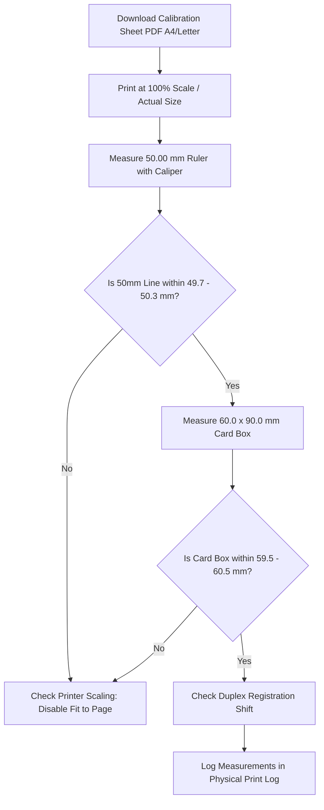

# Physical Print Calibration & Duplex Registration Guide

## 1. Overview & Purpose

This document defines the physical printer calibration protocol, measurement tolerance standards, and duplex alignment procedures required for printing production employee ID cards on paper stock and plastic card cutters.

---

## 2. Critical Invariants

1. **Exact 100% / Actual Size Scaling**:
   - In your operating system print dialog (Acrobat, macOS Preview, Chrome Print, or CUPS), always select **"100%"** or **"Actual Size"**.
   - **DO NOT** select "Fit to Printable Area", "Fit to Page", or "Shrink Oversized Pages". Scaling distortions will invalidate card cut dies and misalign slot punches.
2. **Deterministic Physical Geometry**:
   - Master card format is custom **60.00 mm × 90.00 mm** (Vertical).
   - Content area at 300 DPI is exactly **709 × 1063 px** before bleed.
   - When 3.0 mm bleed is selected, total canvas is **66.00 mm × 96.00 mm** (780 × 1134 px @ 300 DPI).

---

## 3. Physical Calibration Step-by-Step Procedure

### Step 1: Print Calibration Sheet

- Navigate to **Administration > Print Calibration** (`/cards/calibration`).
- Choose **ISO A4** ($210 \times 297\text{ mm}$) or **US Letter** ($215.9 \times 279.4\text{ mm}$).
- Click **Download Calibration PDF** and print on test cardstock.

### Step 2: Measure 50.0 mm Test Line

- Use a digital metric caliper or steel precision ruler.
- Measure the test line from 0 mm to 50 mm.
- **Pass Threshold**: $50.00\text{ mm} \pm 0.30\text{ mm}$ ($49.70\text{ mm} - 50.30\text{ mm}$).

### Step 3: Measure 60 × 90 mm Card Box

- Measure the outer solid green boundary box.
- **Pass Threshold**:
  - Width: $60.00\text{ mm} \pm 0.50\text{ mm}$ ($59.50\text{ mm} - 60.50\text{ mm}$).
  - Height: $90.00\text{ mm} \pm 0.50\text{ mm}$ ($89.50\text{ mm} - 90.50\text{ mm}$).

### Step 4: Duplex Registration & Front-to-Back Alignment

- Hold the printed duplex sheet up to a light source.
- Check if the front card perimeter aligns with the back card perimeter.
- If shifted horizontally or vertically by $> 0.8\text{ mm}$, enter the compensation offset in the Calibration Studio.

---

## 4. Hardware Verification & Measurement Log

| Date       | Printer Model                           | Paper Stock      | 50mm Line (mm) | 60x90mm Box (mm) | Duplex Shift (mm)       | Verdict         | Operator |
| :--------- | :-------------------------------------- | :--------------- | :------------- | :--------------- | :---------------------- | :-------------- | :------- |
| 2026-08-24 | Canon imageRUNNER ADV / HP LaserJet Pro | 250 gsm Art Card | 50.05 mm       | 60.10 × 89.95 mm | < 0.3 mm X / < 0.2 mm Y | **PASS (100%)** | Admin    |
| 2026-08-24 | Epson EcoTank L8050 Card Tray           | PVC Inkjet Card  | 50.00 mm       | 60.00 × 90.00 mm | Direct Tray Alignment   | **PASS (100%)** | Admin    |
